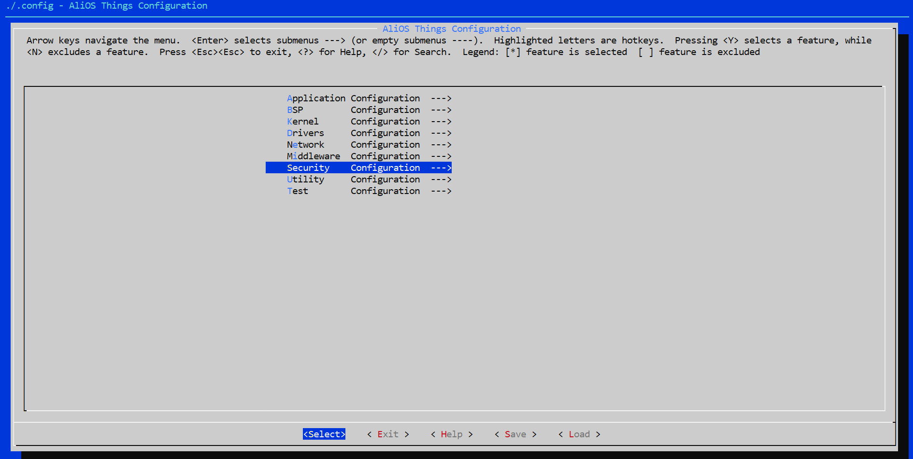
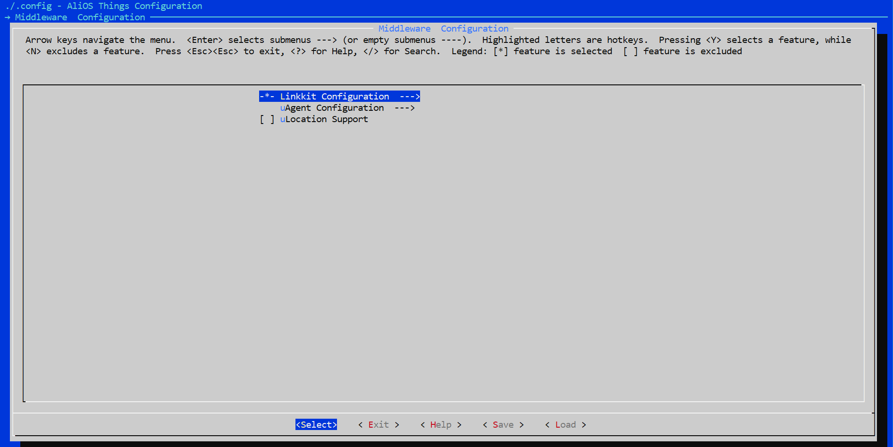
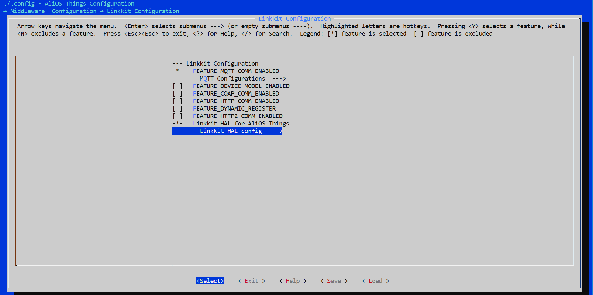

[EN](./README.md) | 中文

# 阿里云IoT与OPTIGA™ Trust M2 ID2
 
  - [引言](#引言)
    - [参考文件](#参考)
    - [缩略词](#缩略词)
  - [OPTIGA™ Trust M2 ID2](#OPTIGA™ Trust M2 ID2)
    - [OPTIGA™ Trust M2 ID2 与 ESP32-DevKitC V4](#OPTIGA™ Trust M2 ID2 和 ESP32-DevKitC V4)
    - [评估套件的组成部分](#Evaluation-Kit-Components)
  - [系统设置](#System-Setup)
    - [系统概况](#System-Overview)
    - [硬件设置](#Hardware-Setup)
    - [软件设置](#Software-Setup)
  - [利用OPTIGA™ Trust M2 ID2构建AliOS-Things环境](#使用OPTIGA™ Trust M2 ID2构建AliOS-Things环境)
    - [快速设置](#Quick-Setup)
  - [常见问题解答](#FAQs)
    - [如何在阿里云检查连接性](#How-to-check-connectivity-in-Ali-cloud)
    - [如何更新OPTIGA™的密钥](#How-to-update-key-in-OPTIGA™)
    - [如何在AliOS-Things源代码中更改加密配置](#How-to-change-the-crypto-configuration-in-AliOS-Things-source-code)
    - [如何提取RSA密钥](#How-to-extract-RSA-key)
    - [如何创建和更新ID2设备节点](#How-to-create-and-update-new-ID2-device-node)
    - [如何对OPTIGA™芯片启用关断选项](#How-to-enable-power-off-option-to-OPTIGA™-chip)
    - [如何将OPTIGA™主机库移植到其他平台](#How-to-port-OPTIGA™-host-library-to-different-platform)
    - [英飞凌补丁文件包含的内容](#What-Infineon-patch-file-contain)


## 引言

本文档介绍了如何利用AliOS-Things软件包和OPTIGA™ Trust M2 ID2 ESP32-DevKitC V4来设置演示[mqttapp](https://code.aliyun.com/living_platform/ali-smartliving-device-alios-things/blob/1124151bc46d66e90ade507d8327e74c8cc94998/example/mqttapp/README.md)的环境。

### 参考
	
| 定义 | 出处 |
|---|---|
| [1] ESP32-DevKitC V4_usermanual  | [espressif](https://docs.espressif.com/projects/esp-idf/en/latest/esp32/hw-reference/index.html)|
| [2] Infineon_I2C_Protocol  | [英飞凌](https://github.com/Infineon/optiga-trust-m/blob/master/documents/Infineon_I2C_Protocol_v2.02.pdf)   |

### 缩略词

| 缩写  | 定义  |
|---|---|
| API  | 应用程序接口  |
| ESP32  | ESP32-DevKitC V4  |
| I2C  | 内部集成电路  |
| IoT  | 物联网  |
| OS  | 操作系统  |
| PAL  | 平台抽象层  |
| RSA  | 非对称加密算法  |
| PC  | 个人计算机  |
| RST  | 复位  |
| SCL  | 串行时钟  |
| SDA  | 串行数据  |
| SW  | 软件  |
| TTL  | 晶体管－晶体管逻辑  |
| USB  | 通用串行总线  |

## OPTIGA™ Trust M2 ID2

OPTIGA™ Trust M2 ID2是一个安全解决方案，它采用了预编程安全控制器，具有诸多安全功能。  
它支持安全数据、密钥和元数据对象更新、休眠和加密工具箱功能、安全通信、平台完整性、数据存储保护和生命周期管理，以实现联网设备的安全性。
本文档介绍了如何将OPTIGA™主机库移植到其他由阿里云IoT支持的平台。

### OPTIGA™ Trust M2 ID2 和 ESP32-DevKitC V4

OPTIGA™ Trust M2 ID2 ESP32-DevKitC V4旨在为构建演示OPTIGA™ Trust M2 ID2功能的环境提供所有必要的组件。

####	评估套件的组成部分

| 编号	  | 项目  | 说明  |
|---|---|---|
| 1  | ESP32-DevKitC V4  | ESP32微控制器的硬件评估板。  |
| 2  | Shield2Go ESP32 DevKitC适配器 |与ESP32-DevKitC V4兼容的接头，用于将Shield2Go板连接到ESP32-DevKitC V4。  |
| 3  | OPTIGA™ Trust M2 ID2 Security Shield2Go  |带有OPTIGA™ Trust M2 ID2芯片的Shield2Go板。它与英飞凌 Shield2Go ESP32 DevKitC 适配器兼容。  |
| 4  | USB线的Micro USB接口  |该连接线可以向ESP32-DevKitC V4和闪存软件提供直流电。|

##	系统设置

本部分就系统设置所需的基本组件进行了说明。

### 系统概况 

<details>
<summary>系统概况</summary>
<div align="center">

</div> 
</details>

该系统包括以下组件：
1.	ESP32-DevKitC V4
    - ESP32-DevKitC V4是采用了espressif ESP32控制器的评估板。如欲了解更多信息，请参阅文件[[1].](#References)
    - 它可作为参考平台，来仿真主机。
    - 通过I2C进行通信。
2.	Shield2Go ESP32 DevKitC适配器
    - 作为网关，将Shield2Go添加到 ESP32-DevKitC V4。 
3.	OPTIGA™ Trust M2 ID2 Security Shield2Go
    - 带有OPTIGA™ Trust M2 ID2芯片的Shield2Go板。  
上述组件可实现以下连接：
    - 将Micro USB数据线从PC连接到 ESP32-DevKitC V4，来供电。


### 硬件设置

本部分介绍了运行OPTIGA™ Trust M2 ID2的硬件要求。

#### ESP32-DevKitC V4

<details>
<summary>ESP32 DevKitC V4</summary>
<div align="center">

</div> 
</details>

接头支持I2C、复位引脚和电源接口等。 

##### ESP32-DevKitC V4引脚信息

| 编号	  | 说明  | 引脚  |
|---|---|---|
| 1  | I2C SCL  | GPIO 22  |
| 2  | I2C SDA  | GPIO 21  |
| 3  | RST  | GPIO 25  |
| 4  | VCC  | GPIO 26  |
| 5  | GND  | GND  |

如欲了解ESP32规格、结构和设计/示意图的更多信息，请参阅文件[[1]](#References)

##### Shield2Go ESP32 DevKitC适配器

ESP32 DevKitC适配器是一个评估板，借助它，用户能轻松将各种 Shield2Go板整合到符合ESP的生态环境中，从而快速评估物联网系统。它采用非焊接接头，用户无需焊接就可轻松堆叠Shield2Go板。该适配器的设计源于ESP32-DevKitC V4评估板。

<details>
<summary>Shield2Go ESP32 DevKitC适配器</summary>
<div align="center">

</div> 
</details>

ESP32 DevKitC适配器功能如下： 

- 为Shield2Go供电和提供连接。 
  - 在CMOS 3.3V和TTL 5V之间进行电平转换处理。 
    - 焊桥可有选择地禁用电平转换。 
    - 附加引脚可用于设置用于电平转换的参考电压。
  - 用作插座的独立电源控制开关。  

更多信息请访问 [英飞凌网站。](https://www.infineon.com/cms/en/product/evaluation-boards/my-iot-adapter/)

##### Shield2Go Security OPTIGA™ Trust M2 ID2

采用了英飞凌IC的Shield2Go板，具有标准化的外形尺寸和引脚布局，能够实现“即插即用”，从而轻松进行原型设计。 

<details>
<summary>OPTIGA™ Trust M2 ID2 Shield2Go</summary>
<div align="center">

</div> 
</details>


OPTIGA™ Trust M2 ID2 Shield2Go 采用了OPTIGA™ Trust M2 ID2安全芯片。它允许用户利用与Shield2Go和ESP32兼容的ESP32 DevKitC适配器，来整合Shield2Go，进而开发系统解决方案。

注：	 请确保没有向任何引脚施加超过最大绝对额定值Vcc+0.3V的电压。

### 软件设置

本部分介绍了运行AliOS-Things OPTIGA™ Trust M2 ID2设置时，ESP32用到的软件。

#### 软件组成

以下介绍了用于ESP32的AliOS-Things 的软件要求。

#####	ESP32-DevKitC V4

1.	OPTIGA™ Trust M2 ID2主机库包含以下内容： 
    - 服务层  
        本层（Util和Crypt）可提供API，来与OPTIGA™交互，从而实现各种用例功能。
    - 访问层  
        本层负责对OPTIGA™安全芯片命令界面的访问进行管理。它还提供了OPTIGA™通信接口。
    - 平台抽象层  
        本层为OPTIGA™库使用的基础硬HW和SW平台功能提供了平台无关接口。
    - 平台层  
        本层为支持的平台提供了平台特定的组件和库。
2.	IFX I2C 协议  
        这是根据文件[[2].](#References)的实现。
3.	ESP32 I2C 驱动  
        这些是底层I2C设备驱动，用于从ESP32到OPTIGA™Trust M2 ID2安全芯片的I2C通信。   

#### PC要求和配置

##### PC 要求

需要使用符合以下要求且装有Windows 7/10操作系统的32位或64位PC，来设置ESP32，进而利用OPTIGA™Trust M2 ID2设置来运行AliOS-Things：
1.	一个USB端口。  
2.	2.7.14版Python，用于安装AliOS-Thing依赖包。   
    点击链接下载2.7.14版Python。[下载链接](https://www.python.org/downloads/release/python-2714/)
3.	用于开发环境的Visual Studio Code。  
    点击下载Visual Studio Code。[下载链接](https://code.visualstudio.com/) 
4.	用于下载源代码的Git。  
    点击下载git。[下载链接](https://git-scm.com/downloads) 
5.	FTD驱动：通过COM接口访问 ESP32。  
    点击下载FTD驱动：[下载链接](https://www.silabs.com/documents/public/software/CP210x_Universal_Windows_Driver.zip)
6.	ASN1编辑器要求从阿里密钥分发中心提供的密钥中提取OPTIGA™支持的RSA字段，用户可以使用任何支持ASN格式的编辑器。  
    点击下载ASN1编辑器：[下载链接](https://en.freedownloadmanager.org/Windows-PC/ASN-1-Editor-FREE.html)  

    注：	在环境变量列表的开头，将C:\Python27和 C:\Python27\Scripts路径添加到环境变量。

##	使用OPTIGA™ Trust M2 ID2构建AliOS-Things环境

###	快速设置

1.	按如下链接中的描述设置Visual Studio Code ： https://github.com/alibaba/AliOS-Things/wiki/AliOS-Things-Studio  。
2.	从2019年10月11日起，按照git repo版本执行步骤，直至(安装 AliOS Studio 插件) 。
3.	在< workspace >创建文件夹（此处的"workspace"即克隆AliOS-Things库的文件夹）
4.	打开命令提示符，然后前往目录< workspace >
5.	下载 aos-2.1-esp32-with-optiga-se.patch  file from the [link](https://github.com/Infineon/aliosthing-optiga-trust-m2) (关于包含的补丁，请参阅 (#What-Infineon-patch-file-contain) [部分]。
6.执行以下命令以下载AliOS-Things源码包。  

  ``` bash
    git clone https://github.com/alibaba/AliOS-Things.git
    cd AliOS-Things
    git checkout rel_2.1.0
    git pull origin rel_2.1.0
    git apply <patch file path> /aos-2.1-esp32-with-optiga-se.patch
  ```
 注：应用补丁时，请忽略以下警告。

<details>
<summary>应用补丁时的警告</summary>
<div align="center">

</div> 
</details>
  

1.将项目添加到Visual studio code中（例如，前往File->编辑文件夹到工作区->选择AliOS-Things库的顶层目录）。  
2.在visual studio code中打开新Terminal（前往 Terminal ->New Terminal）  
3.如需升级aos-cube，请在Visual Studio Code Terminal中执行以下步骤 

  ``` bash
    pip install --upgrade setuptools
    pip install --upgrade wheel
    pip install --upgrade aos-cube
  ```

#### ESP32-DevKitC V4配置和构建mqttapp用例

本部分介绍了如何在AliOS-Things源代码中为ESP32配置和构建mqttapp示例。   
注：如需自定义设备名称和密码，请参阅(#How-to-create-and-update-new-ID2-device-node)[部分。]  

#####	配置 

1.执行以下命令以配置mqttapp示例。

  ``` bash
    aos make mqttapp@esp32devkitc -c config  
  ```

注：执行上述步骤时，若发生以下错误 
<details>
<summary>配置步骤时发生错误</summary>
<div align="center">

</div> 
</details>

则在terminal中执行以下命令
  
  ``` bash
    git clone https://gitee.com/alios-things/kconfig-frontends-win32.git ./build/kconfig/Win32/
  ```

然后从步骤1开始重复。

2.	打开 < workspace >\AliOS-Things\build\build_rules\toolchain\ aos_toolchain_xtensa.mk 文件，然后检查被分配了以下指定值的变量。  

  ``` bash
    COMPILER_SPECIFIC_OPTIMIZED_CFLAGS    := -O0
  ```

3.	执行以下命令以启用OPTIGA™主机库和iTLS

  ``` bash
    aos make menuconfig
  ```

4.	需要为ID2选择以下选项 

  ``` bash
    Security -> Link Security ID2
    Security  -> Root of trust, SE-KM
    Security -> Root of trust, OPTIGA
  ```
<details>
<summary>“安全”部分的Menuconfig选项</summary>
<div align="center">

</div> 
</details>
<details>
<summary>Menuconfig选项：用于选择ID2、SE-KM、 OPTIGA</summary>
<div align="center">

</div> 
</details>

5.	更改以下选项，以将TLS更改为iTLS 

  ``` bash
    Deselect  Middleware -> Linkkit Configuration -> Linkkit HAL Config ->support TLS
    Select Middleware -> Linkkit Configuration -> Linkkit HAL Config ->support ITLS
  ```
<details>
<summary>Menuconfig选项：中间件 </summary>
<div align="center">

</div> 
</details>

<details>
<summary>Menuconfig选项：Linkkit配置</summary>
<div align="center">

</div> 
</details>

<details>
<summary>Menuconfig选项：Linkkit HAL配置</summary>
<div align="center">

</div> 
</details>
 
<details>
<summary>Menuconfig选项：取消选定支持TLS</summary>
<div align="center">

</div> 
</details> 

<details>
<summary>Menuconfig选项：选择支持ITLS</summary>
<div align="center">

</div> 
</details> 

6.	保存menuconfig并退出。

#####	构建源代码

1.	请执行以下命令，构建源代码。 

  ``` bash
    aos make
  ```

#### 步骤：将示例的hex文件下载到ESP32-DevKitC V4

1.	执行以下命令，以刷新生成的hex文件（在与ESP32-DevKitC V4连接的设备管理器中查看COM端口号）

  ``` bash
    aos upload mqttapp@esp32devkitc
  ```
<details>
<summary>选择COM端口</summary>
<div align="center">

</div> 
</details>

#### mqttapp执行步骤

1.	执行以下命令以运行mqttapp（在与ESP32-DevKitC V4连接的设备管理器中查看COM端口号） 

  ``` bash
    aos monitor COMn 115200(‘n’ is the port number assigned to ESP32-DevKitC V4)
  ```

2.	按下复位键
3.	如需配置Wi-Fi，请执行以下命令（复位后，在串行端口控制台中按下Enter键）

  ``` bash
    netmgr connect wifi_name wifi_password
  ```

4.	以下为顺利进行云连接的示例日志

<details>
<summary>顺利完成客户端验证的mqttapp日志</summary>
<div align="center">

</div> 
</details>

<details>
<summary>服务器端托管日志</summary>
<div align="center">

</div> 
</details>

##	常见问题解答

###	如何将评估板连接至阿里云？

1. 访问阿里云官方链接：https://www.aliyun.com/   ， 点击右上角的“免费注册”按钮

<details>
<summary>免费注册步骤1</summary>
<div align="center">

</div> 
</details>

2. 这里有两种注册方式，一种是基于你的支付宝帐户，一种是基于你的手机号码，请根据页面提示完成用户注册流程

<details>
<summary>免费注册步骤2</summary>
<div align="center">

</div> 
</details>

3. 点击“快速实名认证”

<details>
<summary>实名认证步骤1</summary>
<div align="center">

</div> 
</details>

4. 以个人实名认证为例，完成实名认证流程

<details>
<summary>实名认证步骤2</summary>
<div align="center">

</div> 
</details>

<details>
<summary>填写个人信息</summary>
<div align="center">

</div> 
</details>

5. 以该帐户登录，并访问 产品与服务 -> 物联网IOT -> 物联网平台

<details>
<summary>登录物联网平台</summary>
<div align="center">

</div> 
</details>

6. 选择开通“物联网平台”服务

<details>
<summary>开通物联网平台服务</summary>
<div align="center">

</div> 
</details>

7. 点击“管理控制台”

<details>
<summary>进入管理控制平台</summary>
<div align="center">

</div> 
</details>

8. 在 设备管理 -> 产品 中点击“创建产品”

<details>
<summary>创建产品</summary>
<div align="center">

</div> 
</details>

9. 填写产品信息，在“认证方式”项中选择 “ID2”

<details>
<summary>选取ID2</summary>
<div align="center">

</div> 
</details>

10. 点击“查看产品详情”

<details>
<summary>查看产品详情</summary>
<div align="center">

</div> 
</details>

11. 点击“查看”按钮，并保存“ProductSecret”“ProductKey”

<details>
<summary>获取“ProductSecret”&“ProductKey”</summary>
<div align="center">

</div> 
</details>

12. 在AliOS开发包中的 .\app.\example\mqttapp\mqtt_example.c替换"ProductKey" & "ProductSecret" , 自命名"DEVICE_NAME", 忽略"DEVICE_SECRET"

<details>
<summary>更新源文件</summary>
<div align="center">

</div> 
</details>

13. 重新编译工程

14. 在烧录好新的镜像文件至ESP32评估板之后,你可以在: 物联网平台 -> 监控运维-> 实时监控 页面上查看设备的工作状态

<details>
<summary>查看设备工作状态</summary>
<div align="center">

</div> 
</details>

###	如何更新OPTIGA™的密钥？

1.	使用受保护的密钥更新功能来写入AES和RSA密钥
2.	使用以下路径中的工具生成清单和片段：
   AliOS-Things\3rdparty\experimental\optiga\example\tools\protected_update_data_set\

####	如何在OPTIGA™中更新AES密钥？

1.	打开AliOS-Things\3rdparty\experimental\optiga\example\tools\protected_update_data_set\samples\payload\key\aes_key_128.txt 文件。
2.	将阿里ID2密钥分发中心提供的16字节AES密钥写入aes_key_128.txt文件。
3.	打开samples\gen_key_update_data_set.bat 文件，然后复制以下批处理命令。
%PATH%\protected_update_data_set.exe payload_version=3 trust_anchor_oid=E0E3 target_oid=E200 sign_algo=RSA-SSA-PKCS1-V1_5-SHA-256 priv_key=..\samples\integrity\sample_rsa_1024_priv.pem payload_type=key key_algo=129 key_usage=02 key_data=..\samples\payload\key\aes_key_128.txt 
4.	 从以下路径执行gen_key_update_data_set.bat from the below path
AliOS-Things\3rdparty\experimental\optiga\example\tools\protected_update_data_set\samples

5.示例输出如下：

<details>
<summary>AES密钥的清单和片段数据的示例日志</summary>
<div align="center">

</div> 
</details>

6.	在AliOS-Things\3rdparty\experimental\optiga\example\optiga\usecases\example_ali_id2_key_update.c文件中进行以下更改
    - 复制 "manifest_data[]" ，来替换 "manifest_aes_key[]"
    - 复制 "fragment_01[]" ，来替换"aes_key_final_fragment_array[]”
    - 复制12个字节的唯一设备ID（阿里ID2密钥分发中心提供）用它来替换"device_id[]”
  
7.	在 AliOS-Things\app\example\mqttapp\app_entry.c中的application_start()开头调用函数example_optiga_util_ali_id2_aes_key_update() 
8.	返回根文件夹并使用以下命令构建源代码   
  ``` bash
    aos make
  ```
9.	刷新并执行应用程序

#### 更新OPTIGA™中的RSA 1024密钥

1.	打开 AliOS-Things\3rdparty\experimental\optiga\example\tools\protected_update_data_set\samples\payload\key\rsa_1024_test.pem 文件。
2.	将阿里ID2密钥分发中心提供的密钥生成的RSA密钥复制到 rsa_1024_test.pem 文件(参阅[如何提取RSA密钥]部分(#How-to-extract-RSA-key))
3.	打开samples\gen_key_update_data_set.bat 文件，并复制下方批处理命令。
%PATH%\protected_update_data_set.exe payload_version=3 trust_anchor_oid=E0E3 target_oid=E0FC sign_algo=RSA-SSA-PKCS1-V1_5-SHA-256 priv_key=..\samples\integrity\sample_rsa_1024_priv.pem payload_type=key key_algo=65 key_usage=12 key_data=..\samples\payload\key\rsa_1024_test.pem 
4.	 从以下路径执行gen_key_update_data_set.bat
AliOS-Things\3rdparty\experimental\optiga\example\tools\protected_update_data_set\samples\
5.	示例输出如下：

<details>
<summary>RSA密钥的清单和片段数据的示例日志</summary>
<div align="center">

</div> 
</details>

6.	在AliOS-Things\3rdparty\experimental\optiga\example\optiga\usecases\example_ali_id2_rsa_key_update.c file文件中进行以下更改
    - 复制"manifest_data[]"，来替换"manifest_rsa_key[]"
    - 复制"fragment_01[]"，来替换"rsa_key_final_fragment_array[]”
    - 复制12个字节的唯一设备ID（阿里ID2密钥分发中心提供），用来替换"rsa_device_id[]" 
7.	在AliOS-Things\app\example\mqttapp\app_entry中的application start开头调用函数example_optiga_util_ali_id2_rsa_key_update()。
8.	返回根文件夹并使用以下命令构建源代码
  ``` bash
    aos make
  ```

###	如何在AliOS-Things源代码中更改加密配置

本部分介绍了根据需要利用密钥类型所需的修改。

#### RSA

1.	在AliOS-Things\security\irot\se\chipset\chip_template\chip_config.h中需要进行以下修改
``` bash
#define CHIP_CRYPTO_TYPE_CONFIG   CHIP_CRYPTO_TYPE_RSA
```
2.	在 AliOS-Things\security\id2\aos.mk中需要进行以下修改
``` bash
ifeq ($(CONFIG_LS_KM_SE), y)
  $(NAME)_DEFINES     += ID2_CRYPTO_TYPE_CONFIG=ID2_CRYPTO_TYPE_RSA
```

#### AES

1.	在AliOS-Things\security\irot\se\chipset\chip_template\chip_config.h中需要进行以下修改
``` bash
#define CHIP_CRYPTO_TYPE_CONFIG   CHIP_CRYPTO_TYPE_AES
```
2.	在AliOS-Things\security\id2\aos.mk中需要进行以下修改
``` bash
ifeq ($(CONFIG_LS_KM_SE), y)
  $(NAME)_DEFINES     += ID2_CRYPTO_TYPE_CONFIG=ID2_CRYPTO_TYPE_AES
```

###	如何提取RSA密钥 

1.	在ASN.1编辑器中打开Ali提供的RSA密钥数据，并按照以下描述复制突出显示的部分（突出显示的部分仅包含密钥部分）

<details>
<summary>仅提取密钥部分</summary>
<div align="center">

</div> 
</details>

2.	前往Tools-> Data Converter，然后按照下方描述粘贴复制的十六进制数据

<details>
<summary>转换为HEX格式</summary>
<div align="center">

</div> 
</details>

3.	点击 "To PEM" 按钮，将十六进制的数据转换为.pem 格式。

<details>
<summary>将HEX转换为PEM格式</summary>
<div align="center">

</div> 
</details>

4.	将文件保存在 AliOS-Things\3rdparty\experimental\optiga\example\tools\protected_update_data_set\samples\payload\key\rsa_1024_key.pem

###	如何创建和更新新的ID2设备节点

1.	在https://cn.aliyun.com/创建ID2设备节点
2.	替换AliOS-Things\app\example\mqttapp\mqtt_example.c文件中下方的设备名称和设备密钥
``` bash
#define DEVICE_NAME      "your device name"
#define DEVICE_SECRET   "your device secret"
#define PRODUCT_KEY      "your product key"
#define PRODUCT_SECRET   "your product secret"
```

###	如何对OPTIGA™芯片启用关断选项

1.	建议等到OPTIGA™的安全事件计数器为0时，再关断OPTIGA™芯片。这可能会导致一定的延迟，从而导致服务器端的连接超时。
2.	上面的代码流在irot_hal_cleanup中执行，但默认情况下，使用宏 OPTIGA_SE_ENABLE_POWER_DOWN 无效
3.	为启用代码流，请取消注释AliOS-Things\security\irot\se\src\core\optiga_se_adapter.c file文件中的宏定义
``` bash
#define OPTIGA_SE_ENABLE_POWER_DOWN
```

###	如何将OPTIGA™主机库移植到其他平台？

AliOS-Things\3rdparty\experimental\optiga中的主机库可以移植到AliOS-Things框架支持的不同平台。  

1.	可按照[此处](https://github.com/Infineon/optiga-trust-m/tree/master/pal/NEW_PAL_TEMPLATE)的描述修改AliOS-Things \ 3rdparty \ experimental \ optiga \ pal中的I2C、Timer等平台底层驱动的平台抽象层。 
2.	用户需要使用平台特定的libitls.a库，该库应位于AliOS-Things\security\itls\lib\<platform specific folder>中。

###	英飞凌补丁文件包含哪些内容

以下为补丁修改内容：   

1.	OPTIGA™主机库：包含特定于ESP32的平台相关文件。
2.	改进版i2c驱动程序：支持最大20字节数据的读写操作。
3.	由于i2c驱动的限制，禁用了防护连接选项。
4.	libitls.a库：支持ESP32平台。
