EN | [中文](./README-zh.md)

# Alibaba cloud IoT with OPTIGA™ Trust M2 ID2
 
  - [Introduction](#introduction)
    - [References](#References)
    - [Abbreviations](#abbreviations)
  - [OPTIGA™ Trust M2 ID2](#OPTIGA™-Trust-M2-ID2)
    - [OPTIGA™ Trust M2 ID2 with ESP32-DevKitC V4](#OPTIGA™-Trust-M2-ID2-with-ESP32-DevKitC-V4)
    - [Evaluation Kit Components](#Evaluation-Kit-Components)
  - [System Setup](#System-Setup)
    - [System Overview](#System-Overview)
    - [Hardware Setup](#Hardware-Setup)
    - [Software Setup](#Software-Setup)
  - [AliOS-Things environment setup Using OPTIGA™ Trust M2 ID2](#AliOS-Things-environment-setup-Using-OPTIGA™-Trust-M2-ID2)
    - [Quick Setup](#Quick-Setup)
  - [FAQs](#FAQs)
    - [How to check connectivity in Ali cloud](#How-to-check-connectivity-in-Ali-cloud)
    - [How to update key in OPTIGA™](#How-to-update-key-in-OPTIGA™)
    - [How to change the crypto configuration in AliOS-Things source code](#How-to-change-the-crypto-configuration-in-AliOS-Things-source-code)
    - [How to extract RSA key](#How-to-extract-RSA-key)
    - [How to create and update new ID2 device node](#How-to-create-and-update-new-ID2-device-node)
    - [How to enable power off option to OPTIGA™ chip](#How-to-enable-power-off-option-to-OPTIGA™-chip)
    - [How to port OPTIGA™ host library to different platform](#How-to-port-OPTIGA™-host-library-to-different-platform)
    - [What Infineon patch file contain](#What-Infineon-patch-file-contain)


## Introduction

This document describes how to setup the environment to demonstrate [mqttapp](https://code.aliyun.com/living_platform/ali-smartliving-device-alios-things/blob/1124151bc46d66e90ade507d8327e74c8cc94998/example/mqttapp/README.md) using AliOS-Things software package with the OPTIGA™ Trust M2 ID2 ESP32-DevKitC V4.

###	References
	
| Definition | Source |
|---|---|
| [1] ESP32-DevKitC V4_usermanual  | [espressif](https://docs.espressif.com/projects/esp-idf/en/latest/esp32/hw-reference/index.html)|
| [2] Infineon_I2C_Protocol  | [Infineon](https://github.com/Infineon/optiga-trust-m/blob/master/documents/Infineon_I2C_Protocol_v2.02.pdf)   |

### Abbreviations

| Abbreviation  | Definition  |
|---|---|
| API  | Application Programming Interface  |
| ESP32  | ESP32-DevKitC V4  |
| I2C  | Inter Integrated Circuit  |
| IoT  | Internet of Things  |
| OS  | Operating System  |
| PAL  | Platform Abstraction Layer  |
| RSA  | Rivest-Shamir-Adleman  |
| PC  | Personal Computer  |
| RST  | Reset  |
| SCL  | Serial Clock  |
| SDA  | Serial Data  |
| SW  | Software  |
| TTL  | Transistor Transistor Logic  |
| USB  | Universal Serial Bus  |

## OPTIGA™ Trust M2 ID2

OPTIGA™ Trust M2 ID2 is a security solution with a pre-programmed security controller with wide range of security features. 
It supports secure data, key and metadata object update, hibernate and cryptographic toolbox functionalities, secure communication, platform integrity, data store protection and lifecycle management for Connected Device Security.
This document describe the porting guide of OPTIGA™ host library for other platforms supported by AliOS-Things.

### OPTIGA™ Trust M2 ID2 with ESP32-DevKitC V4

OPTIGA™ Trust M2 ID2 ESP32-DevKitC V4 is designed to provide all the components required to setup the environment to demonstrate the features of the OPTIGA™ Trust M2 ID2.

####	Evaluation Kit Components

| No.	  | Item  | Description  |
|---|---|---|
| 1  | ESP32-DevKitC V4  | Hardware Evaluation board for ESP32 microcontroller.  |
| 2  | ESP32 DevKitC Adapter for Shield2Go  |ESP32-DevKitC V4 compatible connector to add Shield2Go board on ESP32-DevKitC V4.  |
| 3  | OPTIGA™ Trust M2 ID2 Security Shield2Go  |Shield2Go board contains OPTIGA™ Trust M2 ID2 chip. It is compatible with Infineon’s ESP32 DevKitC Adapter for Shield2Go.  |
| 4  | Micro USB to USB cable  |The cable provides DC supply to ESP32-DevKitC V4 and to flash software. |

##	System Setup

This section explains the basic components required for system setup.

### System Overview 

<details>
<summary>System Overview</summary>
<div align="center">
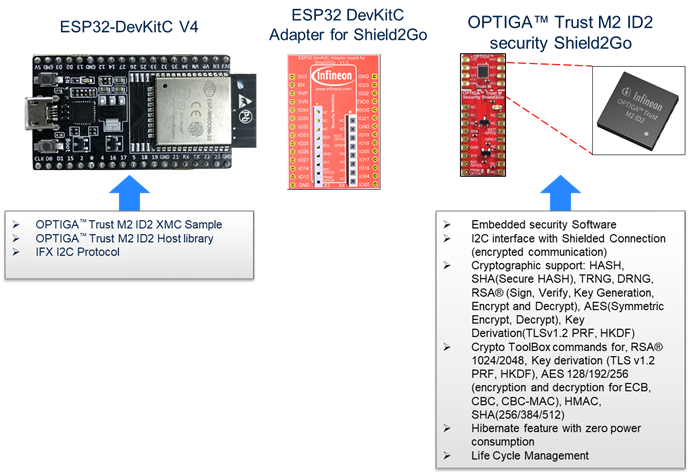
</div> 
</details>

This system consists of the following components:
1.	ESP32-DevKitC V4
    - The ESP32-DevKitC V4 is an evaluation board with ESP32 Microcontroller from   espressif. For more information refer document [[1].](#References)
    - It is used as a reference platform to simulate the Host.
    - It interacts via I2C.
2.	ESP32 DevKitC Adapter for Shield2Go
    - It acts as a gateway to add Shield2Go boards onto ESP32-DevKitC V4. 
3.	OPTIGA™ Trust M2 ID2 Security Shield2Go
    - Shield2Go board contains OPTIGA™ Trust M2 ID2 chip.  
The following interface/connection is done among the above components:
    - Micro USB data cable (with Data line) from PC is connected to ESP32-DevKitC V4 to supply power.


### Hardware Setup

The hardware required to run OPTIGA™ Trust M2 ID2 setup is described in this section.

#### ESP32-DevKitC V4

<details>
<summary>ESP32 DevKitC V4</summary>
<div align="center">
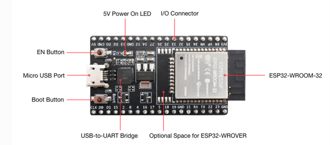
</div> 
</details>

Connector supports I2C, reset pin and power supply interfaces among others. 

##### ESP32-DevKitC V4 Pin Information

| No.	  | Description  | Pin  |
|---|---|---|
| 1  | I2C SCL  | GPIO 22  |
| 2  | I2C SDA  | GPIO 21  |
| 3  | RST  | GPIO 25  |
| 4  | VCC  | GPIO 26  |
| 5  | GND  | GND  |

For more information about the ESP32 Specification, Architecture and Design/Schematic, refer document [[1]](#References)

##### ESP32 DevKitC Adapter for Shield2Go

The ESP32 DevKitC adapter is an evaluation board that allows users to easily combine different Shield2Go boards to ESP compliant ecosystem, for fast evaluation of IoT systems. With its solderless connectors, it allows users to easily stack Shield2Go boards instead of soldering it. The adapter design is derived from ESP32-DevKitC V4 evaluation board.

<details>
<summary>ESP32 DevKitC Adapter for Shield2Go</summary>
<div align="center">

</div> 
</details>

ESP32 DevKitC adapter features are as follows:

- Provide power supply and connectivity for Shield2Go boards. 
  - Level shifting handling capabilities between CMOS 3.3V and TTL 5V. 
    - Solder bridges to selectively deactivate level shifting. 
    - Additional pins enable setting the reference voltages for level shifting.
  - Separate power control switches for Socket.  

More information is available at [Infineon website.](https://www.infineon.com/cms/en/product/evaluation-boards/my-iot-adapter/)

##### Shield2Go Security OPTIGA™ Trust M2 ID2

Shield2Go boards are equipped with featured Infineon ICs and provide a standardized form factor and pin layout, allowing a ‘plug and play’ approach for easy prototyping.

<details>
<summary>OPTIGA™ Trust M2 ID2 Shield2Go</summary>
<div align="center">

</div> 
</details>


The OPTIGA™ Trust M2 ID2 Shield2Go is equipped with OPTIGA™ Trust M2 ID2 security chip. It allows users to develop system solutions by combining Shield2Go with ESP32 DevKitC Adapter for Shield2Go and ESP32.

Note:	 Ensure no voltage supplied to any of the pins exceeds the absolute maximum rating of Vcc + 0.3 V.

### Software Setup

This section describes the software used in ESP32 to run the AliOS-Things OPTIGA™ Trust M2 ID2 setup.

#### Software Components

All the software components required on AliOS-Things for ESP32 are explained in the following sections.

#####	ESP32-DevKitC V4

1.	OPTIGA™ Trust M2 ID2 Host Library consists of the following:
    - Service Layer  
        The layers (Util and Crypt) provide APIs to interact with OPTIGA™ for various use-case functionalities.
    - Access Layer  
        This layer manages the access to the command interface of OPTIGA™ security chip. It also provides the communication interface to the OPTIGA™.
    - Platform Abstraction Layer  
        This layer provides platform agnostic interfaces for the underlying HW and SW platform functionalities used by OPTIGA™ libraries.
    - Platform Layer  
        This layer provides the platform specific components and libraries for the supported platforms.
2.	IFX I2C Protocol  
        This is an implementation as per document [[2].](#References)
3.	ESP32 I2C Driver  
        These are low level I2C device driver for I2C communication from ESP32 to OPTIGA™ Trust M2 ID2 Security chip.   

#### PC Requirements and Configurations

##### PC Requirement

A 32-bit or 64-bit PC with Windows 7/10 Operating System with the below requirements need to be used for setting up ESP32 to run the AliOS-Things using OPTIGA™ Trust M2 ID2 setup:
1.	One USB port.  
2.	Python 2.7.14 version to install AliOS-Thing dependency packages   
    Link to download Python 2.7.14: [Download link.](https://www.python.org/downloads/release/python-2714/)
3.	Visual Studio Code for development environment.  
    Link to download Visual Studio Code: [Download link](https://code.visualstudio.com/) 
4.	Git for downloading source code.  
    Link to download git: [Download link](https://git-scm.com/downloads) 
5.	FTD driver to access ESP32 via COM port.  
    Link to download FTD driver: [Download link](https://www.silabs.com/documents/public/software/CP210x_Universal_Windows_Driver.zip)
6.	ASN1 editor require to extract OPTIGA™ supported RSA fields from key provided by Ali key distribution center user is free to use any editor which supports ASN format.  
    Link to download ASN1 editor: [Download link](https://en.freedownloadmanager.org/Windows-PC/ASN-1-Editor-FREE.html)  

    *Note:	Add C:\Python27 and C:\Python27\Scripts path to environment variable in the beginning of the environment variable list.*

##	AliOS-Things environment setup Using OPTIGA™ Trust M2 ID2

###	Quick Setup

1.	Setup Visual Studio Code as describe from the link
2.	Create a folder in < workspace > (here "workspace" is the folder where AliOS-Things repository will be cloned, for example %USERPROFILE%/Documents)
3.	Open command prompt and go to the directory < workspace >
4.	Download aos-2.1-esp32-with-optiga-se.patch  file from the [link](https://github.com/Infineon/aliosthing-optiga-trust-m2) (Refer [section](#What-Infineon-patch-file-contain) for the patch contain).
5. Execute below commands to download AliOS-Things source package  

  ``` bash
    git clone https://github.com/alibaba/AliOS-Things.git
    cd AliOS-Things
    git checkout rel_2.1.0
    git pull origin rel_2.1.0
    git apply aos-2.1-esp32-with-optiga-se.patch
  ```
 Note: Ignore below warnings while applying the patch

<details>
<summary>Warning while applying patch</summary>
<div align="center">
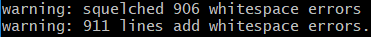
</div> 
</details>
  

1. Add project to Visual studio code (e.g. Go to File->add folder to workspace->select top level directory of AliOS-Things repository).  
8.	Open new Terminal in visual studio code (go to Terminal ->New Terminal)  
9.	To upgrade aos-cube, follow the below steps in Visual Studio Code Terminal 

  ``` bash
    pip install --upgrade setuptools
    pip install --upgrade wheel
    pip install --upgrade aos-cube
  ```

#### Configure and build mqttapp use case for ESP32-DevKitC V4

This section describes how to configure and build mqttapp example in AliOS-Things source code for ESP32.   
Note: To use customize Device name and secret please refer this [section.](#How-to-create-and-update-new-ID2-device-node)  

#####	Configuration 

1. Execute below command to configure the mqttapp example (make sure you run the terminal in the root of the AliOS-Things repository)

  ``` bash
    aos make mqttapp@esp32devkitc -c config  
  ```

Note: while execution above step if below error occurs 
<details>
<summary>Error while configuring the setup</summary>
<div align="center">
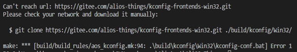
</div> 
</details>

Execute below command in the terminal
  
  ``` bash
    git clone https://gitee.com/alios-things/kconfig-frontends-win32.git ./build/kconfig/Win32/
  ```

Repeat from step 1

2.	Open < workspace >\AliOS-Things\build\build_rules\toolchain\ aos_toolchain_xtensa.mk file and check the variable assigned with the below specified value.  

  ``` bash
    COMPILER_SPECIFIC_OPTIMIZED_CFLAGS    := -O0
  ```

3.	Execute below command to enable OPTIGA™  host library and iTLS

  ``` bash
    aos make menuconfig
  ```

4.	Below options need to be  selected for ID2 

  ``` bash
    Security -> Link Security ID2
    Security -> Root of trust, SE-KM
    Security -> Root of trust, OPTIGA
    Security -> Lightweight TLS Support by ID2
  ```
<details>
<summary>Menuconfig option to Security section</summary>
<div align="center">

</div> 
</details>
<details>
<summary>Menuconfig option to select ID2, SE-KM, OPTIGA</summary>
<div align="center">
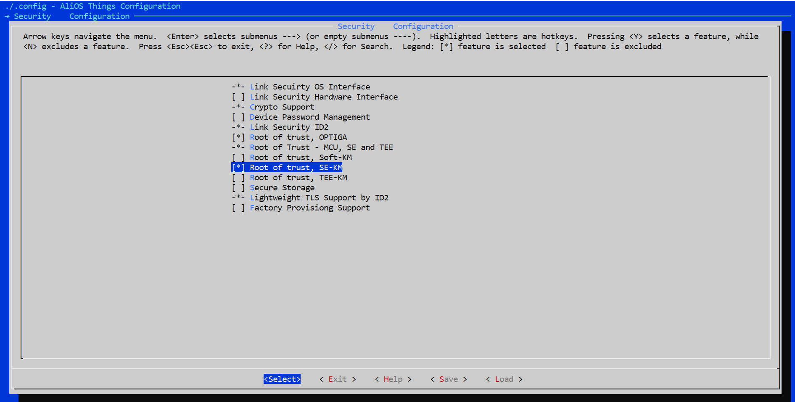
</div> 
</details>

5.	Change below options to change TLS to iTLS 

  ``` bash
    Deselect  Middleware -> Linkkit Configuration -> Linkkit HAL Config ->support TLS
    Select Middleware -> Linkkit Configuration -> Linkkit HAL Config ->support ITLS
  ```
<details>
<summary>Menuconfig option to Middleware</summary>
<div align="center">
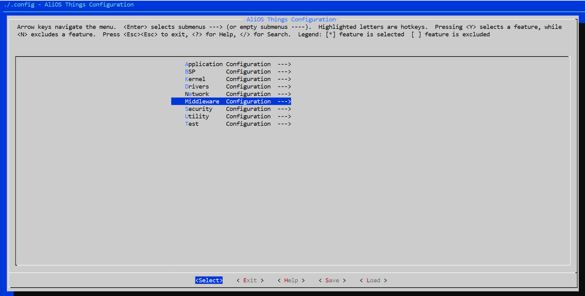
</div> 
</details>

<details>
<summary>Menuconfig option to Linkkit Configuration</summary>
<div align="center">

</div> 
</details>

<details>
<summary>Menuconfig option to Linkkit HAL config</summary>
<div align="center">

</div> 
</details>
 
<details>
<summary>Menuconfig option to deselect support TLS</summary>
<div align="center">

</div> 
</details> 

<details>
<summary>Menuconfig option to select support ITLS</summary>
<div align="center">
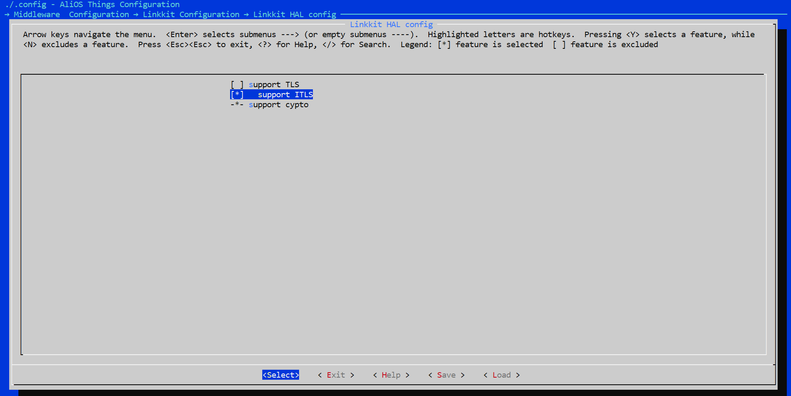
</div> 
</details> 

6.	Save and exit from menuconfig

#####	Build source code

1.	To build source code execute below command (make sure you are running python2.7 "python -V")

  ``` bash
    aos make
  ```

#### Steps to download example hex file to ESP32-DevKitC V4

1.	Execute below command to flash the generated HEX file (Check the COM port number from device manager which is connected with your ESP32-DevKitC V4)

  ``` bash
    aos upload mqttapp@esp32devkitc
  ```
<details>
<summary>Selecting COM port</summary>
<div align="center">

</div> 
</details>

#### Steps to execute mqttapp

1.	Execute below command to run mqttapp (Check the COM port number from device manager which is connected with your ESP32-DevKitC V4) 

  ``` bash
    aos monitor COMn 115200(‘n’ is the port number assigned to ESP32-DevKitC V4)
  ```

2.	Press reset button
3.	To configure Wi-Fi execute below command (after restart press enter in serial port console)

  ``` bash
    netmgr connect wifi_name wifi_password
  ```

4.	Below is the example log of successful cloud connection

<details>
<summary>Successful client server authentication log of mqttapp</summary>
<div align="center">
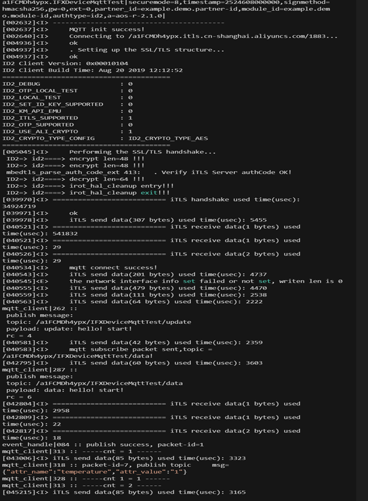
</div> 
</details>

<details>
<summary>Server side hosted log</summary>
<div align="center">
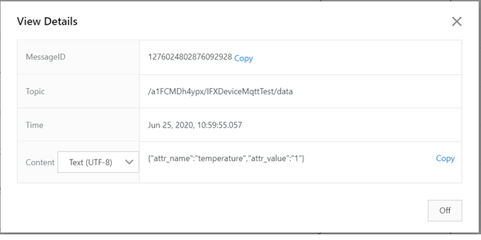
</div> 
</details>

##	FAQs

###	How to check connectivity in Ali cloud

1.	Login to https://cn.aliyun.com/ using personal credential
2.	Go to show device log section

###	How to update key in OPTIGA™

1.	Use protected key update feature to write AES and RSA key
2.	Use the tool in the below path to generate manifest and fragments
   AliOS-Things\3rdparty\experimental\optiga\example\tools\protected_update_data_set\

####	Update AES key in OPTIGA™

1.	Open AliOS-Things\3rdparty\experimental\optiga\example\tools\protected_update_data_set\samples\payload\key\aes_key_128.txt file.
2.	Write 16 bytes AES key provided by ali ID2 key distribution center in aes_key_128.txt file.
3.	Open samples\gen_key_update_data_set.bat file and copy the below batch command.
%PATH%\protected_update_data_set.exe payload_version=3 trust_anchor_oid=E0E3 target_oid=E200 sign_algo=RSA-SSA-PKCS1-V1_5-SHA-256 priv_key=..\samples\integrity\sample_rsa_1024_priv.pem payload_type=key key_algo=129 key_usage=02 key_data=..\samples\payload\key\aes_key_128.txt 
4.	 Execute the gen_key_update_data_set.bat from the below path
AliOS-Things\3rdparty\experimental\optiga\example\tools\protected_update_data_set\samples

5. Example output is shown as below

<details>
<summary>Example log of manifest and fragment data for AES key</summary>
<div align="center">
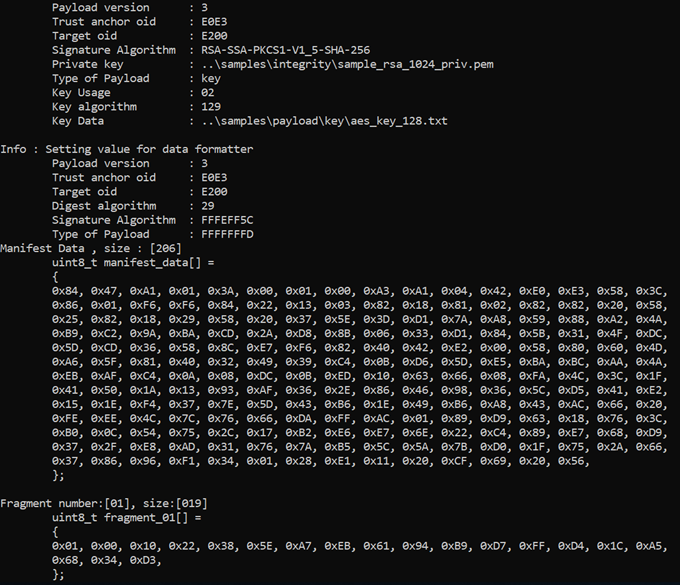
</div> 
</details>

6.	Make the following changes in AliOS-Things\3rdparty\experimental\optiga\example\optiga\usecases\example_ali_id2_key_update.c file
    - Copy "manifest_data[]" and replace it in "manifest_aes_key[]"
    - Copy "fragment_01[]" and replace it in "aes_key_final_fragment_array[]"
    - Copy 12 bytes unique device ID(provided by ali ID2 distribution center) and replace it in "device_id[]"
  
7.	Invoke function example_optiga_util_ali_id2_aes_key_update() in the beginning of application_start() present in AliOS-Things\app\example\mqttapp\app_entry.c
8.	Go back to root folder and build source code using below command   
  ``` bash
    aos make
  ```
9.	Flash and execute application

#### Update RSA 1024 key in OPTIGA™

1.	Open AliOS-Things\3rdparty\experimental\optiga\example\tools\protected_update_data_set\samples\payload\key\rsa_1024_test.pem file.
2.	Copy the RSA key generated from the key provided by Ali ID2 key distribution center in rsa_1024_test.pem file (Refer section [How to extract RSA key](#How-to-extract-RSA-key))
3.	Open samples\gen_key_update_data_set.bat file and copy the below batch command
%PATH%\protected_update_data_set.exe payload_version=3 trust_anchor_oid=E0E3 target_oid=E0FC sign_algo=RSA-SSA-PKCS1-V1_5-SHA-256 priv_key=..\samples\integrity\sample_rsa_1024_priv.pem payload_type=key key_algo=65 key_usage=12 key_data=..\samples\payload\key\rsa_1024_test.pem 
4.	 Execute the gen_key_update_data_set.bat from the below path
AliOS-Things\3rdparty\experimental\optiga\example\tools\protected_update_data_set\samples\
5.	Example output is shown as below

<details>
<summary>Example log of manifest and fragment data for RSA key</summary>
<div align="center">
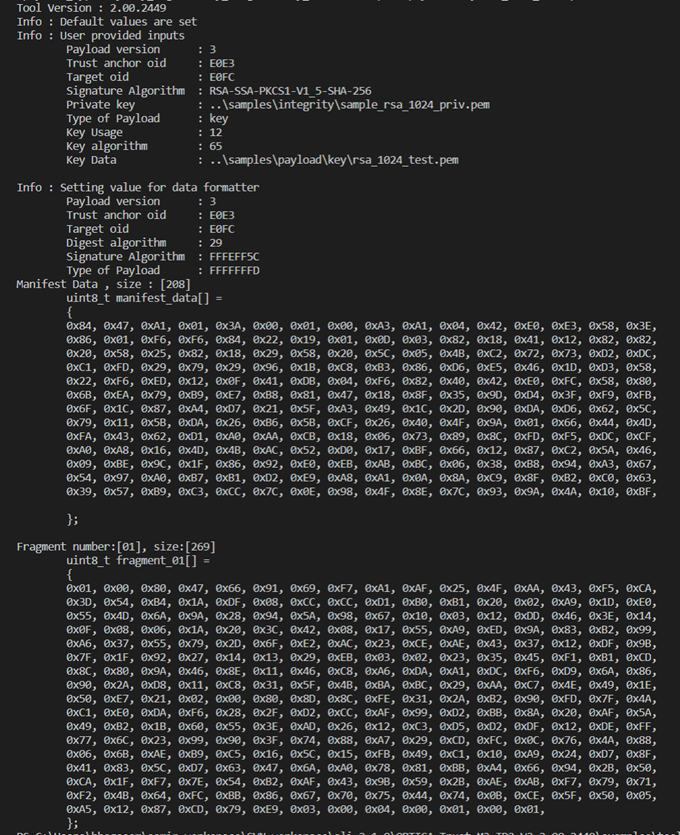
</div> 
</details>

6.	Make the following changes in AliOS-Things\3rdparty\experimental\optiga\example\optiga\usecases\example_ali_id2_rsa_key_update.c file
    - Copy "manifest_data[]" and replace it in "manifest_rsa_key[]"
    - Copy "fragment_01[]" and replace it in "rsa_key_final_fragment_array[]"
    - Copy 12 bytes unique device ID(provided by ali ID2 distribution center) and replace it in "rsa_device_id[]" 
7.	Invoke function example_optiga_util_ali_id2_rsa_key_update() in the beginning of application start() present in AliOS-Things\app\example\mqttapp\app_entry.
8.	Go back to root folder and build source code using below command
  ``` bash
    aos make
  ```

###	How to change the crypto configuration in AliOS-Things source code

This section describes the modification require to use key type as per needs.

#### RSA

1.	Below Modification is required in AliOS-Things\security\irot\se\chipset\chip_template\chip_config.h
``` bash
#define CHIP_CRYPTO_TYPE_CONFIG   CHIP_CRYPTO_TYPE_RSA
```
2.	Below Modification is required in AliOS-Things\security\id2\aos.mk
``` bash
ifeq ($(CONFIG_LS_KM_SE), y)
  $(NAME)_DEFINES     += ID2_CRYPTO_TYPE_CONFIG=ID2_CRYPTO_TYPE_RSA
```

#### AES

1.	Below Modification is required in AliOS-Things\security\irot\se\chipset\chip_template\chip_config.h
``` bash
#define CHIP_CRYPTO_TYPE_CONFIG   CHIP_CRYPTO_TYPE_AES
```
2.	Below Modification is required in AliOS-Things\security\id2\aos.mk
``` bash
ifeq ($(CONFIG_LS_KM_SE), y)
  $(NAME)_DEFINES     += ID2_CRYPTO_TYPE_CONFIG=ID2_CRYPTO_TYPE_AES
```

###	How to extract RSA key 

1.	Open the RSA key data provided by Ali in ASN.1 editor and copy the highlighted section as shown below (from the highlighted section its only contain the key part)

<details>
<summary>Extraction of only key part</summary>
<div align="center">

</div> 
</details>

2.	Go to Tools-> Data Converter and paste the copied hexadecimal data as shown below

<details>
<summary>Converting to HEX format</summary>
<div align="center">
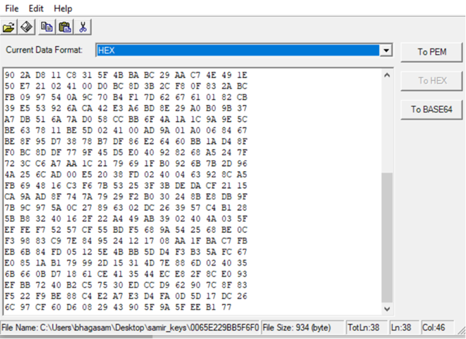
</div> 
</details>

3.	Click button "To PEM" to convert hexadecimal data to .pem format

<details>
<summary>Converting HEX to PEM format</summary>
<div align="center">

</div> 
</details>

4.	Save the file in AliOS-Things\3rdparty\experimental\optiga\example\tools\protected_update_data_set\samples\payload\key\rsa_1024_key.pem

###	How to create and update new ID2 device node

1.	Create an ID2 device node in https://cn.aliyun.com/
2.	Replace the device name and device secret in the below section present in AliOS-Things\app\example\mqttapp\mqtt_example.c file
``` bash
#define DEVICE_NAME      "your device name"
#define DEVICE_SECRET   "your device secret"
#define PRODUCT_KEY      "your product key"
#define PRODUCT_SECRET   "your product secret"
```

###	How to enable power off option to OPTIGA™ chip

1.	Before doing an OPTIGA™ chip power off, it is recommended to wait until the security event counter on OPTIGA™ reaches zero. This can lead to certain time delays which leads to connection timeout on the server side.
2.	The above code flow is implemented in irot_hal_cleanup but it is disabled by default using macro OPTIGA_SE_ENABLE_POWER_DOWN.
3.	To enable the code flow, uncomment the macro definition present in AliOS-Things\security\irot\se\src\core\optiga_se_adapter.c file
``` bash
#define OPTIGA_SE_ENABLE_POWER_DOWN
```

###	How to port OPTIGA™ host library to different platform

The host library present in AliOS-Things\3rdparty\experimental\optiga location can be port to different platform supported by the AliOS-Things framework.  

1.	Platform abstraction layer for platform low level drivers like I2C, Timer located in AliOS-Things\3rdparty\experimental\optiga\pal can be modified as described [here](https://github.com/Infineon/optiga-trust-m/tree/master/pal/NEW_PAL_TEMPLATE).
2.	User need to use platform specific libitls.a library which should be present in AliOS-Things\security\itls\lib\<platform specific folder>.

###	What Infineon patch file contain

Below are the modification present in the patch.   

1.	OPTIGA™ host library including platform dependent file for ESP32 specific.
2.	Modified i2c driver to support read and write operation for maximum 20bytes of data
3.	Shielded connection option is disabled due to the limitation of the i2c driver.
4.	ESP32 platform supported libitls.a library.

		
		
		
 
  

